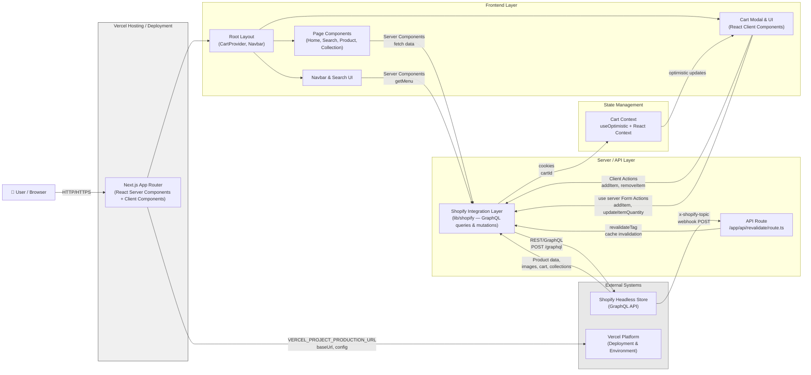

Now I have comprehensive evidence. Let me synthesize the technology architecture analysis.

---

# Technology Architecture: Next.js Commerce

## Architecture Diagram



---

## Architecture Narrative

### Overview

This repository is **Next.js Commerce**, a headless e-commerce storefront that separates the presentation layer from the commerce backend. The application is a monolithic Next.js App Router application that serves as both the frontend and the API orchestration layer, communicating with **Shopify** as the headless commerce platform via its GraphQL Admin/Storefront API.

---

### Major Runtime Components

#### 1. Next.js App Router Frontend (Verified)

**Responsibility**: The primary application runtime. Handles routing, server-side rendering, client-side hydration, and composition of all UI components.

**Implementation**: `app/layout.tsx`, `app/page.tsx`, `app/product/[handle]/page.tsx`, `app/search/` directory, `app/api/revalidate/route.ts`.

**Evidence**:
- `next.config.ts` enables experimental features: `ppr: true`, `inlineCss: true`, `useCache: true` — indicating Partial Prerendering and fine-grained caching strategy
- `package.json` specifies `"next": "15.6.0-canary.60"` and `"react": "19.0.0"`
- `app/layout.tsx` is the root layout, an async server component that passes a `cartPromise` to `CartProvider` without awaiting it (streaming pattern)
- Pages use React Server Components by default (`async` default exports without `"use client"`)

**Runtime**: Executes on Vercel edge/middleware or Node.js runtime depending on route segment configuration.

---

#### 2. Cart Context & State Management (Verified)

**Responsibility**: Manages the shopping cart as optimistic UI state shared across client components. Decouples UI responsiveness from server-side cart synchronization.

**Implementation**: `components/cart/cart-context.tsx`, `components/cart/actions.ts`, `components/cart/modal.tsx`, `components/cart/add-to-cart.tsx`

**Evidence**:
- `cart-context.tsx` creates a `CartContext` using `createContext`, exposes `useCart()` hook
- Uses `useOptimistic` for instant UI updates before server confirmation
- Cart state is initialized from a `Promise<Cart | undefined>` passed from the server via `CartProvider cartPromise={cart}` in `layout.tsx`
- `"use client"` directives on all cart interaction components
- `actions.ts` contains `"use server"` server actions for `addItem`, `removeItem`, `updateItemQuantity`, `redirectToCheckout`, `createCartAndSetCookie`

**Communication**: Client components call `useCart()` to access cart state and `addCartItem()` / `updateCartItem()` for optimistic updates. Server actions (`addItem`, `removeItem`) sync with Shopify and call `updateTag(TAGS.cart)` to invalidate Next.js cache.

---

#### 3. Shopify Integration Layer (Verified)

**Responsibility**: Single source of truth for all Shopify GraphQL interactions. Encapsulates queries, mutations, data reshaping, caching tags, and revalidation logic.

**Implementation**: `lib/shopify/index.ts`, `lib/shopify/queries/`, `lib/shopify/mutations/`, `lib/shopify/fragments/`, `lib/shopify/types.ts`

**Evidence**:
- `lib/shopify/index.ts` exports `shopifyFetch<T>()` — the core HTTP function that POSTs to Shopify's GraphQL endpoint with `X-Shopify-Storefront-Access-Token` header
- GraphQL queries live in `lib/shopify/queries/` (cart, collection, menu, page, product)
- GraphQL mutations live in `lib/shopify/mutations/cart.ts` (createCart, addToCart, removeFromCart, editCartItems)
- Data reshaping functions (`reshapeCart`, `reshapeProduct`, `reshapeCollection`) transform Shopify raw responses into application types
- Uses `unstable_cacheLife` and `unstable_cacheTag` from `next/cache` for caching with tags `collections`, `products`, `cart`
- `lib/shopify/types.ts` defines all TypeScript types for Shopify responses (Product, Collection, Cart, Menu, Page, etc.)
- `lib/type-guards.ts` provides `isShopifyError()` for error handling

**Key Configuration** (`lib/constants.ts`):
- `SHOPIFY_GRAPHQL_API_ENDPOINT = "/api/2023-01/graphql.json"`
- `HIDDEN_PRODUCT_TAG = "nextjs-frontend-hidden"`
- `TAGS = { collections, products, cart }` — used for cache invalidation

---

#### 4. Presentation Components (Verified)

**Responsibility**: UI composition using Tailwind CSS, Headless UI, and Heroicons.

**Evidence**:
- `components/layout/navbar/index.tsx` — async server component fetching menu from Shopify
- `components/layout/navbar/search.tsx` — client component with search form (`"use client"`)
- `components/layout/footer.tsx` — async server component with `Suspense` fallback
- `components/cart/modal.tsx` — client component with `@headlessui/react` Dialog, image display, quantity editing
- `components/product/gallery.tsx`, `components/product/product-description.tsx`, `components/product/variant-selector.tsx` — product detail sub-components
- `components/grid/`, `components/carousel.tsx` — layout components

**Dependencies**: `@headlessui/react`, `@heroicons/react`, `tailwindcss`, `@tailwindcss/typography`, `@tailwindcss/container-queries`

---

#### 5. Shopify External Commerce Platform (Verified)

**Responsibility**: Headless commerce backend providing products, collections, cart state, and inventory.

**Evidence**:
- `.env.example` defines `SHOPIFY_STORE_DOMAIN`, `SHOPIFY_STOREFRONT_ACCESS_TOKEN`, `SHOPIFY_REVALIDATION_SECRET`
- `lib/shopify/index.ts` calls `fetch(endpoint, { method: "POST", headers: { "X-Shopify-Storefront-Access-Token": key } })`
- `next.config.ts` configures `remotePatterns` for `cdn.shopify.com/s/files/**` to allow Next.js `next/image` optimization
- `lib/utils.ts` validates `SHOPIFY_STORE_DOMAIN` and `SHOPIFY_STOREFRONT_ACCESS_TOKEN` on startup
- `app/api/revalidate/route.ts` receives Shopify webhook topics (`collections/*`, `products/*`) to trigger cache revalidation

**Communication**: GraphQL REST API via `fetch`. Cart state persists via `cartId` cookie. Cache invalidation uses Next.js `revalidateTag()` called from the revalidation webhook.

---

#### 6. API Route: Revalidation Webhook (Verified)

**Responsibility**: Receives Shopify webhook notifications to invalidate stale cache.

**Evidence**: `app/api/revalidate/route.ts` exports `POST` handler that calls `revalidate(req)` from `lib/shopify/index.ts`. Validates `SHOPIFY_REVALIDATION_SECRET` query parameter and `x-shopify-topic` header. Calls `revalidateTag(TAGS.collections, "seconds")` or `revalidateTag(TAGS.products, "seconds")` on matching topics.

---

### Communication Flows

#### Flow 1: Product Browsing & Search (Server-Side Rendering)
```
User → Next.js Router → Page Component (Server Component)
  → lib/shopify.getProducts() / getCollectionProducts()
    → fetch(SHOPIFY_ENDPOINT, { query, variables })
      → Shopify GraphQL API
        → Reshaped Product/Collection data
          → Cached via next/cache (tags: products, collections; life: days)
            → Rendered JSX with Grid/ProductGridItems
```

#### Flow 2: Cart Operations (Optimistic + Server Actions)
```
User clicks "Add to Cart" → add-to-cart.tsx (client component)
  → useCart().addCartItem(variant, product) — optimistic UI update
  → form action calls addItem() from components/cart/actions.ts ("use server")
    → lib/shopify.addToCart([{merchandiseId, quantity}])
      → fetch(SHOPIFY_ENDPOINT, mutation: cartLinesAdd)
        → cartId from cookies()
      → updateTag(TAGS.cart) — invalidates Next.js cart cache
    → re-render with updated cart context
```

#### Flow 3: Shopify Webhook Revalidation
```
Shopify → POST /api/revalidate (x-shopify-topic, secret)
  → validates SHOPIFY_REVALIDATION_SECRET
  → matches topic to collection/product webhooks
  → revalidateTag(TAGS.collections, "seconds") or revalidateTag(TAGS.products, "seconds")
  → Next.js cache invalidated on next request
```

---

### Data Stores & Persistence

| Store | Technology | Evidence |
|-------|-----------|----------|
| **Primary Data** | Shopify GraphQL API | `lib/shopify/index.ts` — all products, collections, cart fetched from Shopify |
| **Cart State** | React Context (in-memory) + cookies | `cart-context.tsx` uses `useOptimistic`; `cartId` stored in browser cookie via `cookies().set("cartId", ...)` |
| **Server Cache** | Next.js Data Cache (`useCache: true`) | `unstable_cacheLife("days")`, `cacheTag(TAGS.xxx)` in `lib/shopify` |
| **Configuration** | Environment variables | `.env.example` defines Shopify credentials; `lib/utils.ts` validates them |

---

### Configuration Boundaries

**Environment Variables** (`.env.example`):
- `SHOPIFY_STORE_DOMAIN` — required, used to construct GraphQL endpoint
- `SHOPIFY_STOREFRONT_ACCESS_TOKEN` — required, used for API authentication
- `SHOPIFY_REVALIDATION_SECRET` — required for webhook validation
- `COMPANY_NAME`, `SITE_NAME` — branding configuration
- `VERCEL_PROJECT_PRODUCTION_URL` — used by `lib/utils.ts` for `baseUrl`

**Next.js Configuration** (`next.config.ts`):
- `experimental.ppr: true` — Partial Prerendering enabled
- `experimental.useCache: true` — App Router caching enabled
- Image remote patterns restricted to `cdn.shopify.com`

---

### Deployment & Runtime Boundaries

**Deployment**: Vercel platform. The README describes `vercel link`, `vercel env pull`, and Vercel integration with Shopify. The `baseUrl` utility checks `VERCEL_PROJECT_PRODUCTION_URL`.

**Runtime**: Next.js App Router with React 19 Server Components. The architecture uses server components by default with selective `"use client"` directives on interactive components (cart modal, search form, add-to-cart form).

---

### Trust & Security Boundaries

- **Shopify API credentials** are environment variables never committed to source
- **Webhook validation** requires `SHOPIFY_REVALIDATION_SECRET` matching query parameter
- **Cart cookie** (`cartId`) is the session identifier for cart operations
- **Content Security**: Product images served from `cdn.shopify.com` with Next.js image optimization restricting remote patterns

---

### Summary of Architecture Classification

| Component | Classification | Basis |
|-----------|---------------|-------|
| Next.js App Router | Verified | `package.json`, `app/` directory, `next.config.ts` |
| Shopify GraphQL integration | Verified | `lib/shopify/index.ts`, `.env.example`, `next.config.ts` remotePatterns |
| Cart Context (React) | Verified | `components/cart/cart-context.tsx`, `components/cart/actions.ts` |
| Cache strategy (Next.js `useCache`) | Verified | `next.config.ts` + `lib/shopify/index.ts` `unstable_cache*` usage |
| Revalidation API route | Verified | `app/api/revalidate/route.ts`, `lib/shopify/index.ts` `revalidate()` export |
| Vercel deployment | Verified | `README.md`, `lib/utils.ts` `VERCEL_PROJECT_PRODUCTION_URL`, footer Deploy button |
| Sonner toast notifications | Verified | `package.json` dependency, `app/layout.tsx` `<Toaster>` import |
| Headless UI Dialogs | Verified | `package.json` `@headlessui/react`, `cart/modal.tsx` `<Dialog>` usage |

---

### Unknowns & Limitations

- **No explicit database layer**: The repository does not use PostgreSQL, MongoDB, or any traditional database. All persistence is through Shopify and browser cookies.
- **No message queue**: No Redis, RabbitMQ, or other async messaging infrastructure is present. Cache invalidation is synchronous via webhook.
- **No authentication service**: User authentication (login, accounts) is not present in the codebase — this is a storefront-only application.
- **Search functionality**: While the README mentions "Orama" as an integration for typeahead search, the current search implementation (`app/search/page.tsx`) uses Shopify's `getProducts()` with a text query — no dedicated search service is wired up by default.
- **Testing**: The `test` script in `package.json` only runs `pnpm prettier:check` — no unit/integration tests exist in the repository.