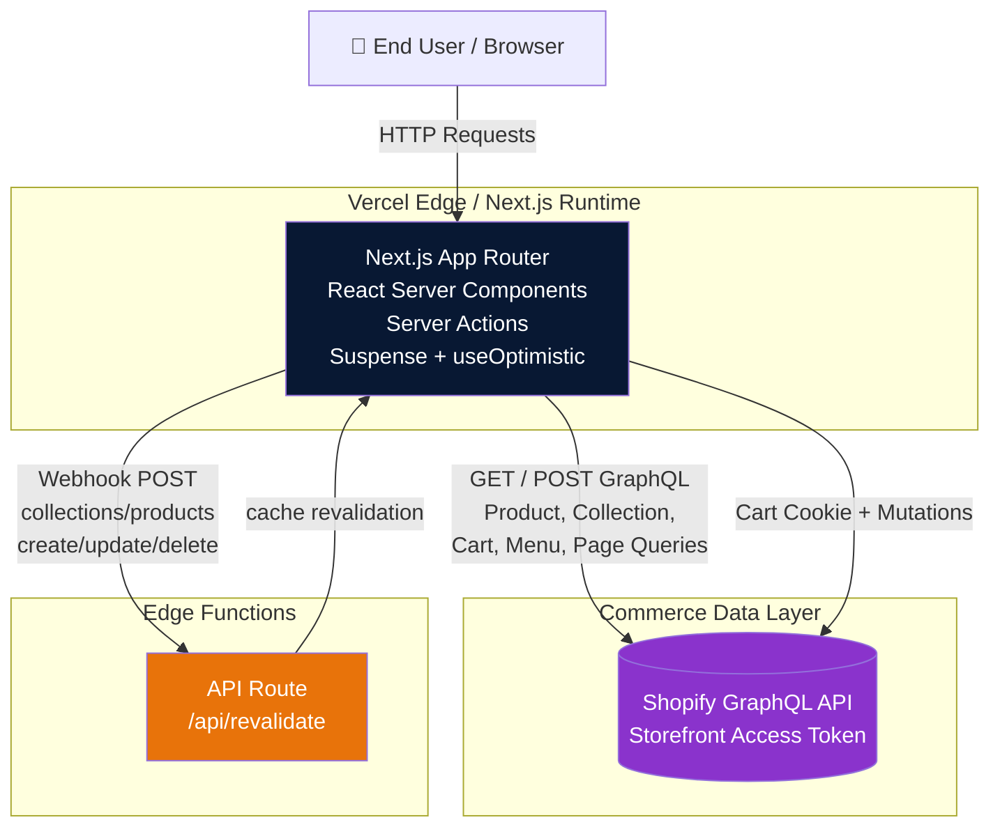

Based on the evidence gathered from the repository, here is the complete Technology Architecture analysis.

---

# Technology Architecture: Vercel/Commerce

## Overview

This repository is **Next.js Commerce** — a high-performance, server-rendered ecommerce storefront built with the **Next.js App Router** and **Shopify** as the headless commerce backend. There is no custom backend server; all application logic executes within the Next.js runtime on Vercel, communicating directly with Shopify's GraphQL API and Browser-native cart state management via React Server Components and Server Actions.

---

## Architecture Diagram



---

## Major Runtime Components

### 1. Next.js App Router — Frontend and Server Layer

**Responsibility:** Serves all UI, handles routing, server-renders pages via React Server Components, executes Server Actions for cart mutations, and manages client-side state via React context and `useOptimistic`.

**Technology:** Next.js 15.6.0-canary.60, React 19.0.0, TypeScript 5.8.2

**Key configuration (verified):**
- `next.config.ts` enables experimental `ppr`, `inlineCss`, and `useCache`
- Tailwind CSS v4 with PostCSS for styling
- `@headlessui/react` for accessible dialogs/modals
- `@heroicons/react` for iconography

**Entry points:**
- `app/layout.tsx` — Root layout, initializes `CartProvider` with a server-side cart fetch
- `app/page.tsx` — Home page (`ThreeItemGrid`, `Carousel`, `Footer`)
- `app/product/[handle]/page.tsx` — Dynamic product pages with JSON-LD SEO metadata
- `app/search/page.tsx` — Product listing / search results
- `app/search/[collection]/page.tsx` — Collection-based browsing
- `app/[page]/page.tsx` — Editable CMS pages from Shopify
- `app/api/revalidate/route.ts` — Webhook endpoint for cache invalidation

**Evidence certainty:** Verified — all files present and functional routes confirmed.

---

### 2. Shopify Integration Layer — Commerce Backend

**Responsibility:** All communication with Shopify's Storefront GraphQL API. Handles queries, mutations, response shaping, caching tags, and revalidation logic.

**Technology:** Native `fetch` to Shopify GraphQL endpoint, Next.js `unstable_cacheLife`/`unstable_cacheTag` for caching

**Key module:** `lib/shopify/index.ts`
- `shopifyFetch<T>()` — Generic GraphQL transport function
- Product queries (`getProduct`, `getProducts`, `getProductRecommendations`)
- Collection queries (`getCollection`, `getCollections`, `getCollectionProducts`)
- Cart queries and mutations (`getCart`, `createCart`, `addToCart`, `removeFromCart`, `updateCart`)
- Menu and Page queries (`getMenu`, `getPage`, `getPages`)
- `revalidate()` — Webhook handler for cache tag invalidation

**Configuration (verified via `.env.example`):**
- `SHOPIFY_STORE_DOMAIN` — Storefront domain
- `SHOPIFY_STOREFRONT_ACCESS_TOKEN` — Authentication token
- `SHOPIFY_REVALIDATION_SECRET` — Webhook verification secret

**Evidence certainty:** Verified — the `lib/shopify/` directory contains all Shopify communication logic. The endpoint is constructed at runtime from environment variables.

---

### 3. Cart Management System

**Responsibility:** Shopping cart state management with optimistic UI updates and server-backed persistence via Shopify's cart GraphQL API.

**Technology:** React Context (`cart-context.tsx`), `useOptimistic` for optimistic updates, Server Actions (`components/cart/actions.ts`) for mutations

**Architecture flow:**
1. `CartProvider` (in root layout) passes a `cartPromise` to context
2. `useCart()` hook reads the promise and applies optimistic reducer updates locally
3. Server Actions (`addItem`, `removeItem`, `updateItemQuantity`, `redirectToCheckout`) call `lib/shopify` cart functions
4. Cart ID persisted in browser cookie (`cartId`)
5. Cart created on first visit via `createCartAndSetCookie()`

**Key files:**
- `components/cart/cart-context.tsx` — React context + optimistic reducer
- `components/cart/actions.ts` — Server actions for cart mutations
- `components/cart/modal.tsx` — Client-side cart UI with dialog transitions
- `components/cart/open-cart.tsx`, `add-to-cart.tsx`, `delete-item-button.tsx`, `edit-item-quantity-button.tsx` — Cart sub-components

**Evidence certainty:** Verified — the cart system is fully implemented with optimistic updates and server-backed mutations.

---

### 4. UI Component Library

**Responsibility:** Presentation layer components shared across pages.

**Technology:** React, Tailwind CSS, `@headlessui/react`, `@heroicons/react`, `clsx`, `geist` font

**Key components:**
- `components/layout/navbar/` — Navigation with menu, search, cart trigger
- `components/layout/footer/` — Footer with menu links
- `components/grid/` — Product grid layout (1/2/3 column responsive)
- `components/product/` — Product gallery, description, variant selector
- `components/cart/` — Cart modal, open/cart button, quantity controls
- `components/layout/search/` — Search bar, collection filters, sort dropdown
- `components/carousel.tsx` — Product carousel
- `components/price.tsx` — Currency-formatted price display

**Evidence certainty:** Verified — 45 `.tsx` files contain the complete component tree.

---

### 5. Cache and Revalidation System

**Responsibility:** On-demand cache invalidation triggered by Shopify webhooks.

**Technology:** Next.js `revalidateTag()`, `unstable_cacheTag()`, API route

**Flow:**
1. Shopify sends webhook POST to `/api/revalidate` on product/collection changes
2. `app/api/revalidate/route.ts` validates the `SHOPIFY_REVALIDATION_SECRET`
3. Based on webhook topic (`collections/create|delete|update`, `products/create|delete|update`), calls `revalidateTag(TAGS.products)` or `revalidateTag(TAGS.collections)`
4. Next.js automatically revalidates cached data tagged with those tags

**Cache tags (verified in `lib/constants.ts`):**
- `collections` — Collection data (cache life: days)
- `products` — Product data (cache life: days)
- `cart` — Cart data (cache life: seconds, private)

**Evidence certainty:** Verified — revalidation endpoint exists with secret validation and tag-based invalidation.

---

## Data Stores and Persistence

### Primary Data Store: Shopify GraphQL API
- **Type:** Remote SaaS commerce backend
- **Access:** HTTPS POST to `https://{domain}/api/2023-01/graphql.json`
- **Authentication:** Storefront Access Token in request headers
- **Data types:** Products, collections, pages, menus, cart operations
- **Caching:** Next.js cache with tag-based invalidation (`cacheTag`, `cacheLife`)
- **Evidence:** Directly visible in `lib/shopify/index.ts` and all query/mutation files

### Secondary: Browser Cookies
- **Cart ID (`cartId`)** — Persists cart identity across requests
- **Evidence:** `cookies()` API from Next.js used in cart actions

### No Local Database
- The repository contains no database driver, ORM, migration, or schema files
- All persistent state is managed by Shopify and browser cookies

---

## External Systems and Integrations

| System | Role | Evidence |
|--------|------|----------|
| **Shopify** | Commerce backend (products, cart, checkout, collections, pages) | `.env.example`, `lib/shopify/index.ts`, `next.config.ts` remotePatterns |
| **Vercel** | Hosting and edge runtime | `baseUrl` uses `VERCEL_PROJECT_PRODUCTION_URL`, `vercel link` referenced in README |
| **Tailwind CSS v4** | Styling framework | `tailwindcss` in dependencies, `postcss.config.mjs` |
| **@headlessui/react** | Accessible UI components (modals, dialogs) | Dependency, used in `modal.tsx` |
| **@heroicons/react** | Icon library | Dependency, used throughout UI |
| **geist** | Font family | Dependency, loaded in `layout.tsx` |
| **sonner** | Toast notifications | Dependency, used in `layout.tsx` |

---

## Configuration Boundaries

### Environment Variables (Verified in `.env.example`)
- `COMPANY_NAME` — Display name
- `SITE_NAME` — Storefront title
- `SHOPIFY_STORE_DOMAIN` — Shopify store domain (required)
- `SHOPIFY_STOREFRONT_ACCESS_TOKEN` — API authentication (required)
- `SHOPIFY_REVALIDATION_SECRET` — Webhook verification (required)

### Runtime Configuration
- `next.config.ts` — PPR enabled, inline CSS, cache enabled, image formats (AVIF/WebP), remote image patterns restricted to `cdn.shopify.com`
- `postcss.config.mjs` — Tailwind CSS PostCSS plugin
- `tsconfig.json` — TypeScript configuration

---

## Communication Flows

### 1. Page Request Flow (Server-Side Rendering)
```
User → Next.js Router → Server Component → Shopify GraphQL Query → JSON Response → SSR HTML
```
- All page data fetched on the server via async Server Components
- `generateMetadata` functions run server-side for SEO (product, page metadata)
- `Suspense` boundaries used for loading states on search, product gallery

### 2. Cart Mutation Flow (Server Action + Optimistic Update)
```
User clicks Add/Remove/Update → Client Component → Server Action → Shopify GraphQL Mutation → Cart Cookie Update → Cache Revalidation → Optimistic UI Update
```
- Server Actions execute on the server, call `lib/shopify` cart functions
- `updateTag(TAGS.cart)` triggers cache revalidation
- `useOptimistic` in `cart-context.tsx` applies changes instantly in the UI before the server responds

### 3. Webhook Revalidation Flow
```
Shopify Webhook POST → /api/revalidate → Secret Validation → revalidateTag() → Next.js Cache Invalidation → 200 Response
```
- Shopify sends webhooks on product/collection changes
- Endpoint responds with 200 immediately to prevent retries

### 4. Navigation Flow
```
User clicks link → Next.js Link (prefetch=true) → Next.js Router → Server Component → Page Content
```
- All navigation uses Next.js `<Link>` with `prefetch={true}`
- Search page uses `Suspense` for async data loading

---

## Deployment and Runtime Boundaries

### Runtime Environment
- **Edge Runtime** via Vercel (Next.js deployed on Vercel edge network)
- **No custom server** — all logic runs within Next.js
- **No background workers or scheduled jobs** identified in the repository

### Build and Start
- Build: `next build`
- Dev: `next dev --turbopack`
- Start: `next start`

### Verification Notes
- `pnpm-lock.yaml` confirms pnpm is the package manager
- `app/api/revalidate/route.ts` is the only API route — all other "API" communication happens through Shopify GraphQL
- No Dockerfiles, Kubernetes manifests, or CI/CD files present in the repository

---

## Summary of Architectural Certainty

| Component | Classification | Confidence |
|-----------|---------------|------------|
| Next.js App Router + React Server Components | Verified | High — core framework files confirmed |
| Shopify GraphQL as primary data source | Verified | High — `lib/shopify/index.ts` with all queries/mutations |
| Cart system with optimistic updates | Verified | High — `cart-context.tsx` and `actions.ts` fully implemented |
| Server Actions for cart mutations | Verified | High — `"use server"` directive in `actions.ts` |
| Cache revalidation via webhooks | Verified | High — `app/api/revalidate/route.ts` with secret validation |
| Tailwind CSS + Headless UI + Heroicons | Verified | High — dependencies and usage confirmed |
| Background workers / message queues | Not present | N/A — no evidence of async job infrastructure |
| Local database / ORM | Not present | N/A — no database driver or schema files |
| Custom backend API server | Not present | N/A — only webhook endpoint exists |

---

## Conclusion

The Vercel/Commerce repository implements a **clean, single-runtime ecommerce architecture**: a Next.js App Router application that serves as both the frontend UI and the API layer, communicating exclusively with Shopify's GraphQL API for all commerce data. Cart state is managed through a React context with optimistic updates backed by Server Actions that mutate Shopify's cart API and persist the cart ID in browser cookies. The entire system is deployed on Vercel's edge network with tag-based cache invalidation triggered by Shopify webhooks. There is no custom backend server, no database, and no background processing infrastructure — the architecture is intentionally minimal and fully hosted.