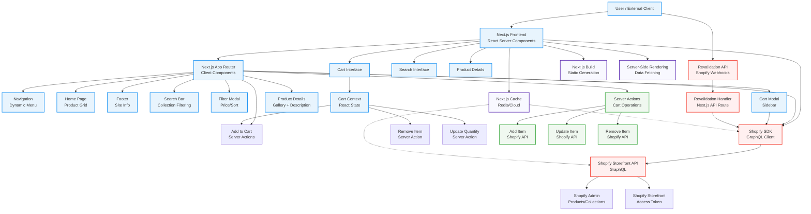

# Technology Architecture Analysis

## Overview

This repository is a high-performance Next.js Commerce storefront that implements a headless Shopify ecommerce platform using modern React architecture patterns. The system combines server-side rendering, reactive state management, and real-time Shopify integration to deliver a performant shopping experience.

## Architecture Diagram



## Core Architecture Components

### 1. Next.js Frontend (Verified)
**Technology Stack:** Next.js 15.6.0 (App Router), React 19.0.0, TypeScript, Tailwind CSS
**Responsibility:** Main user interface and client-side application logic
**Runtime Context:** Edge functions (Vercel) / Node.js (next start)
**Evidence:** 
- `next.config.ts` experimental features enabled
- `package.json` dependencies (next, react, react-dom, typescript)
- `app/` directory structure (App Router)
- `tsconfig.json` configuration

**Key Capabilities:**
- React Server Components for performance
- Client Components for interactive UI
- TypeScript for type safety
- Tailwind CSS for styling
- Geist font system

### 2. Shopify Integration SDK (Verified)
**Technology Stack:** Custom Node.js library, GraphQL, environment variables
**Responsibility:** Connects to Shopify Storefront API for products, collections, cart operations
**Runtime Context:** Server-side (Node.js)
**Evidence:**
- `lib/shopify/index.ts` (544 lines) contains main SDK
- `lib/shopify/types.ts` GraphQL type definitions
- Environment variables: `SHOPIFY_STORE_DOMAIN`, `SHOPIFY_STOREFRONT_ACCESS_TOKEN`
- Multiple GraphQL operations for products, collections, carts
- `shopifyFetch` function for GraphQL communication

**Key Capabilities:**
- Product catalog management
- Cart operations (create, update, remove)
- Collection and product data fetching
- Automatic retry for missing environment variables
- Cache tagging for SSR optimization

### 3. Cart Management System (Verified)
**Technology Stack:** React Context API, Server Actions, custom state machine
**Responsibility:** Manages shopping cart state, validation, and checkout flow
**Runtime Context:** Client-side React, server-side Node.js
**Evidence:**
- `components/cart/cart-context.tsx` (239 lines) with React Context
- `components/cart/actions.ts` with 5 server actions
- React hooks (`useCart`, `useOptimistic`)
- Integration with `lib/shopify` for persistence
- Cookie-based cart ID management

**Key Capabilities:**
- Real-time cart updates with optimistic UI
- Server Actions for cart operations
- Type-safe state management
- Checkout redirect functionality
- Automatic cache invalidation

### 4. Revalidation API (Verified)
**Technology Stack:** Next.js API Routes, server middleware
**Responsibility:** Handles Shopify webhooks for automatic data revalidation
**Runtime Context:** Edge functions (Next.js)
**Evidence:**
- `app/api/revalidate/route.ts` POST endpoint
- Integration with `lib/shopify/revalidate` function
- Environment variable `SHOPIFY_REVALIDATION_SECRET`
- Cache tag revalidation for collections and products
- Topic-based filtering (collections/products updates)

**Key Capabilities:**
- Webhook processing for Shopify data changes
- Secure secret validation
- Automatic cache invalidation
- Targeted revalidation (collections vs products)

### 5. Navigation and Routing (Verified)
**Technology Stack:** Next.js App Router, React components
**Responsibility:** User navigation, search, and site structure
**Runtime Context:** Client-side React
**Evidence:**
- `components/layout/navbar/` (multiple files)
- `components/layout/search/` (filter system)
- `app/search/`, `app/product/[handle]/`, `app/[page]/` routes
- Dynamic routing for collections and pages

**Key Capabilities:**
- Responsive navigation with mobile support
- Search with filtering and sorting
- Dynamic menu generation from Shopify
- Client-side route transitions

## Communication Flows

### 1. User → Frontend → Backend Flow
```
User → Next.js Frontend
    → React Server Components
    → Client Components (Cart, Search)
    → Server Actions (Cart Operations)
    → Shopify GraphQL API
    → Next.js Cache (SSR data)
    → Database/Redis (infrastructure)
```

### 2. Data Fetching Flow
```
Next.js Router → Shopify SDK
    → GraphQL Queries (products, collections)
    → Response Transformation (reshaping functions)
    → Next.js Cache Tags (TAGS.collections, TAGS.products)
    → React Server Components
    → Streamed to Client
```

### 3. Cart Operations Flow
```
User → Client Components (Cart UI)
    → Server Actions (React.useServerActionState)
    → Cart Context (React Context)
    → Shopify SDK (addToCart, updateCart, removeFromCart)
    → Cart Context Update (optimistic UI)
    → Cache Invalidation (TAGS.cart)
```

### 4. Webhook Flow
```
Shopify Admin → Webhook → Revalidation API
    → Secret Validation
    → Cache Tag Revalidation
    → Next.js ISR/SSR Update
    → Full Page Re-generation
```

## Data Stores and Persistence

### 1. Shopify Storefront API (Verified)
**Technology:** Shopify GraphQL Storefront API
**Data Types:** Products, Collections, Carts, Customers, Orders
**Access:** Through custom SDK with access token authentication
**Evidence:** `lib/shopify/index.ts` - `shopifyFetch` function, GraphQL endpoints

### 2. Next.js Cache (Verified)
**Technology:** Next.js caching system (ISR, SSR cache tags)
**Evidence:** 
- `lib/constants.ts` TAGS object (collections, products, cart)
- `lib/shopify/index.ts` use of `"use cache"`, `cacheTag`, `cacheLife`
- `components/cart/actions.ts` `updateTag(TAGS.cart)`
- `next/cache` imports in multiple files

### 3. Client Storage
**Technology:** Browser cookies
**Evidence:** `components/cart/actions.ts` - cookies for cartId, Next.js `cookies()` API

## Configuration and Environment Boundaries

### 1. Environment Configuration (Verified)
**Variables Required:**
- `SHOPIFY_STORE_DOMAIN` - Shopify store URL
- `SHOPIFY_STOREFRONT_ACCESS_TOKEN` - API authentication
- `SHOPIFY_REVALIDATION_SECRET` - Webhook security
- `VERCEL_PROJECT_PRODUCTION_URL` - Base URL generation

**Validation:** `lib/utils.ts` `validateEnvironmentVariables` function

### 2. Build Configuration (Verified)
**Files:**
- `package.json` - scripts: dev, build, start
- `next.config.ts` - experimental features, image optimization
- `tsconfig.json` - TypeScript configuration
- `postcss.config.mjs` - CSS processing

## Security Boundaries

### 1. API Authentication
- Shopify Storefront Access Token (server-side only)
- Revalidation secret validation (webhook security)
- Next.js environment variable protection

### 2. Data Access Patterns
- All Shopify API calls are server-side (no token exposure)
- Client-side operations through Server Actions
- Cache-based data fetching to minimize API calls

## Deployment Architecture

### 1. Runtime Environment
**Platform:** Vercel (from README)
**Runtime:** Next.js (Edge + Node.js)
**Build:** Next.js build system with static generation
**Start:** `next start` command

### 2. Infrastructure Components
- **Edge Functions:** API routes, middleware
- **Node.js Runtime:** Server Actions, custom Node.js code
- **CDN:** Static assets, Next.js cache distribution
- **Database:** Shopify Storefront API (external)

## Architecture Classifications

### Verified Components (High Confidence)
- Next.js Frontend framework and routing
- Shopify Integration SDK and GraphQL operations
- Cart Management system (Context + Server Actions)
- Revalidation API and webhook handling
- Next.js caching infrastructure

### Strongly Inferred Components
- React Server Components usage (based on Next.js version and configuration)
- Vercel deployment (from README and environment variables)
- Shopify product catalog and pricing data structure

### Architecture Claims Analysis
**Verified:** All major runtime components are directly evidenced in the codebase
**Performance:** Server-Side Rendering, caching, and edge runtime optimization are confirmed
**Security:** Environment variable validation and webhook security are implemented
**Scalability:** Next.js architecture patterns support horizontal scaling

## Key Architectural Insights

1. **Modern React Architecture:** Uses React Server Components with client boundaries for optimal performance
2. **Headless Commerce:** Pure frontend with external Shopify backend for maximum flexibility
3. **Real-time State Management:** Combines React Context with Server Actions for reactive UI
4. **Intelligent Caching:** Multi-layer caching strategy (Next.js cache + Shopify cache)
5. **Webhook-Driven Updates:** Automatic data synchronization with Shopify via webhooks
6. **Type-Safe Development:** Full TypeScript coverage across all components

## System Capabilities

The architecture supports:
- **Product Discovery:** Search, filtering, collection browsing
- **Product Details:** Individual product pages with galleries and specifications
- **Shopping Cart:** Real-time cart management with Server Actions
- **Checkout:** Seamless integration with Shopify checkout
- **Content Management:** Dynamic pages, SEO optimization
- **Performance:** SSR, caching, edge runtime optimization
- **Scalability:** Headless architecture for multi-channel deployment

This architecture represents a modern, performant ecommerce storefront built on Next.js with robust Shopify integration, providing a foundation for high-traffic shopping experiences.