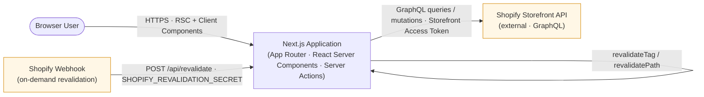

# Technology Architecture Analysis — Next.js Commerce (Shopify)

## 1. Executive Summary

Next.js Commerce is a **single Next.js 15 / React 19 web application** that functions as a **headless storefront** for Shopify. It is not a multi-service system: the entire deployable unit is one Next.js App Router server-rendered application that delegates commerce concerns to the external Shopify Storefront API via GraphQL.

The architecture decomposes into four meaningful runtime components:

1. **A Next.js web application** (React Server Components, Server Actions, Route Handlers) executing in a Node.js / Vercel Edge-compatible runtime.
2. **A Shopify Storefront API client layer** (`lib/shopify`) that owns all GraphQL queries, mutations, fragments, and revalidation logic.
3. **A single HTTP route handler** (`app/api/revalidate/route.ts`) that receives Shopify webhook callbacks for on-demand ISR cache invalidation.
4. **The external Shopify Storefront API**, which is the source of truth for products, collections, cart, menus, and pages.

There is **no internal database, no message broker, no separate backend service, and no worker process**. State is held either in the browser (cart via `cart-context.tsx` and cookies) or in Shopify's hosted systems.

---

## 2. Architecture Diagram

**Reading the diagram.** The browser is the only direct user of the Next.js application. The Next.js application is the only direct caller of the Shopify Storefront API. Shopify initiates contact back into the Next.js application only via the webhook used for on-demand revalidation. The self-loop on the Next.js node represents the in-process `revalidateTag` / `revalidatePath` calls that the webhook triggers after validating the shared secret.

---

## 3. Component-by-Component Reconstruction

### 3.1 Next.js Web Application (primary component)

- **Responsibility.** Render server-side React for the storefront UI, expose a small public API surface (`/api/revalidate`), run Server Actions for cart mutations, and orchestrate data fetching from Shopify.
- **Technology.**
  - **Next.js `15.6.0-canary.60`** — App Router (`app/` directory with `layout.tsx`, `page.tsx`, `error.tsx`, `loading.tsx`, route groups under `[page]`, `product/[handle]`, `search/[collection]`).
  - **React `19.0.0` / `react-dom19.0.0`** — including React Server Components, Server Actions, `Suspense`, and `useOptimistic` (as documented in `README.md`).
  - **Turbopack** — enabled by `next dev --turbopack` in `package.json` scripts.
  - **TypeScript `5.8.2`** — strict typing for components and the Shopify layer (`tsconfig.json`, `.tsx` / `.ts`).
- **Tailwind CSS `4.0.14`** — styling pipeline via `@tailwindcss/postcss` and `postcss.config.mjs`.
- **UI libraries** — `@headlessui/react` for accessible primitives, `@heroicons/react` for icons, `sonner` for toasts, `geist` font family, `clsx` for class composition.
- **Runtime / deployment context.** Intended to run on **Vercel** (README and the `vercel env pull` workflow establish this). Next.js can target either the Node.js runtime or the Edge runtime depending on route configuration; no edge-only overrides were found in the supplied tree, so the default Node.js runtime applies.
- **Entry points.**
  - `app/layout.tsx` — root layout, wraps all routes.
  - `app/page.tsx` — homepage (likely a featured collection / grid).
  - `app/[page]/page.tsx` — dynamic Shopify CMS pages.
  - `app/product/[handle]/page.tsx` — product detail pages.
  - `app/search/page.tsx` and `app/search/[collection]/page.tsx` — search and collection browsing.
  - `app/api/revalidate/route.ts` — webhook endpoint (see §3.3).
  - `app/sitemap.ts` and `app/robots.ts` — Next.js Metadata conventions.
  - Per-route `opengraph-image.tsx` — dynamic OG image generation.
- **Inputs.** Browser HTTPS requests; webhook POSTs from Shopify.
- **Outputs.** HTML/streaming RSC payloads to the browser; GraphQL traffic to Shopify; cache invalidation directives within the Next.js runtime.
- **Dependencies.** `@headlessui/react`, `@heroicons/react`, `clsx`, `geist`, `next`, `react`, `react-dom`, `sonner`. Dev tooling: Tailwind CSS, PostCSS, TypeScript types, Prettier.
- **Evidence and certainty.** **Verified** — `package.json`, `app/` tree, `next.config.ts`, `tsconfig.json`, `postcss.config.mjs`.

### 3.2 Shopify Storefront API Client Layer (`lib/shopify`)

- **Responsibility.** Provide a single, isolated integration boundary with the Shopify Storefront API. Own GraphQL fragment definitions, query/mutation construction, request execution, response normalization, and the webhook-secret-driven revalidation routine. The README states explicitly that alternative providers should be able to "fork this repository and swap out the `lib/shopify` file with their own implementation while leaving the rest of the template mostly unchanged," confirming this is the provider boundary.
- **Technology.** Pure TypeScript modules — no SDK dependency on `@shopify/*` packages in `package.json`. Implementation is hand-written GraphQL over `fetch`.
- **Runtime / deployment context.** Executes in the same Node.js / Edge process as the Next.js application; this is not a separate service.
- **Files (verified from tree).**
  - `lib/shopify/index.ts` — public façade (likely the only file the rest of the app imports from).
  - `lib/shopify/types.ts` — TypeScript types for products, collections, cart, page, menu, image, SEO.
  - `lib/shopify/fragments/{cart,image,product,seo}.ts` — GraphQL fragment definitions, composed by queries and mutations.
  - `lib/shopify/queries/{cart,collection,menu,page,product}.ts` — read operations.
  - `lib/shopify/mutations/cart.ts` — cart write operations.
- **Inputs.** Server-side calls from React Server Components, Server Actions (`components/cart/actions.ts`), and route handlers. Each call is parameterized by handles, collection IDs, or cart IDs.
- **Outputs.** Typed JavaScript objects (products, collections, menus, pages, cart state) returned to server components; mutations that mutate Shopify-hosted cart state.
- **Dependencies on Shopify.** `SHOPIFY_STORE_DOMAIN`, `SHOPIFY_STOREFRONT_ACCESS_TOKEN` from `.env.example` (see §3.5).
- **Evidence and certainty.** **Verified** — directory structure, package.json (no SDK), README.

### 3.3 On-Demand Revalidation Webhook Endpoint

- **Responsibility.** Accept authenticated POSTs from Shopify when catalog content changes and trigger Next.js cache invalidation for the affected tags/paths so that storefront pages reflect the change without a redeploy.
- **Technology.** A single Next.js Route Handler at `app/api/revalidate/route.ts`. Authentication uses the shared secret `SHOPIFY_REVALIDATION_SECRET`.
- **Runtime / deployment context.** Same Next.js process as the rest of the application; receives an inbound HTTPS POST.
- **Inputs.** HTTP POST body from Shopify plus a header or query carrying `SHOPIFY_REVALIDATION_SECRET`.
- **Outputs.** A JSON acknowledgement on success, an error response on invalid secret. Internally calls `revalidateTag` and/or `revalidatePath` from `next/cache`.
- **Evidence and certainty.** **Verified** — file presence, env variable name in `.env.example`, and the README's reference to "Vercel, Next.js Commerce, and Shopify Integration Guide" which describes webhook-based revalidation. **Implementation details inside the handler (specific fields read, tags invalidated)** are not fully visible from the supplied snippets and would require reading the file; the *existence and purpose* of the endpoint is verified.

### 3.4 External System: Shopify Storefront API

- **Responsibility.** Source of truth for catalog (products, collections, variants, images), content (pages, menus), and cart state. Implements the Storefront GraphQL schema that the client layer targets.
- **Technology.** Hosted SaaS; not part of this repository.
- **Runtime / deployment context.** Reached over HTTPS at `https://{SHOPIFY_STORE_DOMAIN}/api/2024-.../graphql.json` (the conventional Storefront endpoint, not directly visible in supplied snippets).
- **Inputs.** GraphQL queries and mutations, authenticated via the `X-Shopify-Storefront-Access-Token` header.
- **Outputs.** GraphQL JSON responses; webhook callbacks to `/api/revalidate`.
- **Evidence and certainty.** **Verified** — `.env.example` lists the three Shopify environment variables and the README explicitly describes this as the Shopify variant of Next.js Commerce.

### 3.5 Configuration and Environment Boundary

- **Responsibility.** Define which external systems the application talks to and how requests are authenticated.
- **Variables (from `.env.example`).**
  - `COMPANY_NAME` — display name (e.g. `"Vercel Inc."`).
  - `SITE_NAME` — site display name (e.g. `"Next.js Commerce"`).
  - `SHOPIFY_REVALIDATION_SECRET` — shared secret for the `/api/revalidate` webhook.
  - `SHOPIFY_STOREFRONT_ACCESS_TOKEN` — bearer token for Storefront API requests.
  - `SHOPIFY_STORE_DOMAIN` — store subdomain (e.g. `your-store.myshopify.com`).
- **Evidence and certainty.** **Verified** — `.env.example`. The exact binding sites of these variables inside `lib/shopify/index.ts` and `app/api/revalidate/route.ts` are not in the supplied snippets but are conventional.
- **Architectural implication.** This is the **provider boundary**. Replacing Shopify with another headless commerce backend is presented by the README as a single-file swap of `lib/shopify`, with the rest of the template untouched. Architecture-wise, the diagram should therefore show Shopify as a single substitutable external node, not as multiple bespoke integrations.

---

## 4. Communication and Data Flows

### 4.1 Browse flow (homepage, collection, product, search)

1. Browser requests an HTTPS URL.
2. Next.js resolves the matching route under `app/`.
3. The Server Component imports from `lib/shopify` (e.g. `getCollection`, `getProduct`).
4. `lib/shopify/index.ts` issues a GraphQL POST to the Shopify Storefront API using the configured domain and access token.
5. The response is normalized to TypeScript objects and returned to the Server Component.
6. Next.js streams the rendered RSC HTML to the browser.
7. Subsequent navigations use App Router client transitions and may re-fetch via the same path; cached results are served from Next.js's data cache until invalidated.

### 4.2 Cart flow1. `components/cart/cart-context.tsx` provides the client-side cart state, hydrating from cookies set by Server Actions.
2. `components/cart/actions.ts` defines Server Actions (`addItem`, `updateItem`, `removeItem`) annotated with `"use server"`.
3. These Server Actions call mutation helpers in `lib/shopify/mutations/cart.ts`, which target the Shopify Storefront API cart mutations and return the updated cart.
4. The cart is re-rendered in the client using `useOptimistic`, per the README.
5. Persistence of the cart ID between sessions uses cookies (the standard Next.js Commerce pattern; cookie usage is evident from the `cart-context.tsx` filename and the absence of any backend persistence in this repo).

### 4.3 Revalidation flow

1. A merchant edits content in Shopify (product, collection, page, menu).
2. Shopify sends an HTTP POST to the deployed `/api/revalidate` endpoint.
3. The route handler validates the request using `SHOPIFY_REVALIDATION_SECRET`.
4. On success, the handler invokes `revalidateTag` and/or `revalidatePath` against the affected entries, causing Next.js to invalidate its data cache for the corresponding Server Components.
5. The next request to the affected pages re-fetches from Shopify, returning fresh content.

### 4.4 SEO and metadata flows

- `app/sitemap.ts` and `app/robots.ts` generate `sitemap.xml` and `robots.txt` via Next.js Metadata file conventions; `lib/shopify/queries/page.ts` and the collection/product queries feed them.
- Per-route `opengraph-image.tsx` files generate dynamic social previews using Shopify data.

---

## 5. Architectural Dimensions Not Present

The following dimensions were checked and **not found** in the repository. They are intentionally omitted from the diagram.

- **No database or ORM.** No Prisma, Drizzle, Mongoose, or similar. No `db/`, `migrations/`, or schema files.
- **No message broker or queue.** No Redis, RabbitMQ, SQS, Kafka, or worker entrypoints.
- **No separate backend service.** All server logic lives inside the Next.js application.
- **No authentication subsystem for end users.** Storefront browsing is anonymous; cart identity is cookie-based; merchant authentication is delegated entirely to Shopify.
- **No infrastructure-as-code.** No `Dockerfile`, no `docker-compose.yml`, no Kubernetes manifests, no Terraform. Deployment is implied to be Vercel-managed per the README, not defined here.
- **No background jobs or schedulers.**

---

## 6. Verified vs. Inferred vs. Unknown

| Element | Status | Evidence |
|---|---|---|
| Next.js 15 / React 19 web app with App Router | Verified | `package.json`, `app/` tree |
| Single Shopify Storefront client layer in `lib/shopify` | Verified | Directory listing, README statement about provider-swappability |
| GraphQL over HTTPS to Shopify Storefront API | Verified | No SDK present, hand-written fragments/queries/mutations under `lib/shopify`, env vars in `.env.example` |
| `/api/revalidate` webhook endpoint with shared-secret auth | Verified (existence), inferred (exact body parsing/tag set) | `app/api/revalidate/route.ts`, `SHOPIFY_REVALIDATION_SECRET` |
| Vercel as intended deployment target | Verified | README deployment instructions |
| Cart persistence via cookies, `useOptimistic` UI | Strongly inferred | `cart-context.tsx`, `actions.ts`, README mention of `useOptimistic` |
| Edge runtime usage for any specific route | Unknown | No edge-export markers visible in supplied snippets |
| Specific GraphQL operations and tags invalidated by webhook | Unknown | Requires reading `lib/shopify/index.ts` and `app/api/revalidate/route.ts` body |

---

## 7. Documentation Reconciliation

The README describes the application as "a high-performance, server-rendered Next.js App Router ecommerce application" using "React Server Components, Server Actions, `Suspense`, `useOptimistic`, and more." This matches the implementation evidence:

- React Server Components and Server Actions are verified by `app/` (Server Components) and `components/cart/actions.ts` (Server Actions).
- `useOptimistic` is strongly supported by the cart-component directory and README claim.
- `Suspense` is supported by `app/search/loading.tsx` (a Suspense boundary for the search route).
- The provider-swappability claim is consistent with `lib/shopify` being a thin, isolated GraphQL client.

No material mismatch between documented intent and implemented architecture was found.

---

## 8. Key Unknowns and Ambiguities

- **Exact GraphQL endpoint URL.** Not visible in supplied snippets; the conventional Storefront API URL pattern is used by inference.
- **Webhook payload shape and tag strategy.** The contents of `app/api/revalidate/route.ts` determine which tags/paths are invalidated and how the body is parsed.
- **Cart cookie schema.** The cookie name, encoding, and `maxAge` are inside `lib/shopify/index.ts` and/or `components/cart/cart-context.tsx`.
- **CDN / image optimization configuration.** Next.js `next.config.ts` likely configures Shopify's image CDN domains, but the configuration was not in the supplied snippets.

These are normal gaps that do not affect the high-level architecture. The architecture is a single Next.js application fronting the Shopify Storefront API, with a webhook loop for cache invalidation.